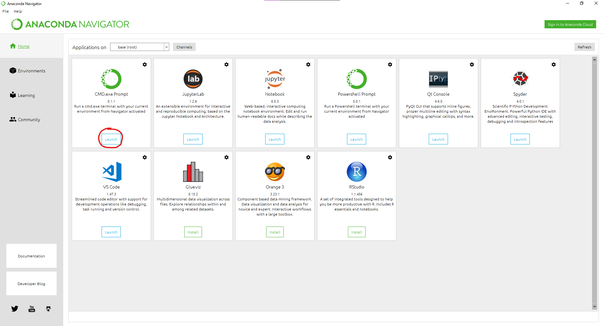

# Tensorflow-2-Custom-object-detection-and-Raspberrypi-usage
### Learn how to Train a TensorFlow Custom Object Detector with TensorFlow-GPU

This repository is a guide to use TensorFlow Object Detection API for training a custom object detector with TensorFlow 2 versions. ***As of 11/16/2022 I have tested with TensorFlow 2.8.0 to train a model on Windows 10 with a Nvidia 3080 Graphics Card.***

## Table of Content
1. [Installing Tensorflow GPU](https://github.com/bgarciapong/Tensorflow-2-Custom-object-detection-and-Raspberrypi-usage/edit/main/README.md#installing-tensorflow-gpu)
2. [Workspace and Anaconda virtual enviroment](https://github.com/bgarciapong/Tensorflow-2-Custom-object-detection-and-Raspberrypi-usage/edit/main/README.md#workspace-and-anaconda-virtual-enviroment)
3. [training Data](https://github.com/bgarciapong/Tensorflow-2-Custom-object-detection-and-Raspberrypi-usage/edit/main/README.md#training-data)
4. [Training Pipeline](https://github.com/bgarciapong/Tensorflow-2-Custom-object-detection-and-Raspberrypi-usage/edit/main/README.md#training-pipeline)
5. [Training model](https://github.com/bgarciapong/Tensorflow-2-Custom-object-detection-and-Raspberrypi-usage/edit/main/README.md#training-model)
6. [Test Finished Model](https://github.com/bgarciapong/Tensorflow-2-Custom-object-detection-and-Raspberrypi-usage/edit/main/README.md#test-finished-model)
7. [exporting the model](https://github.com/bgarciapong/Tensorflow-2-Custom-object-detection-and-Raspberrypi-usage/edit/main/README.md#exporting-the-model)
8. [installing Tensorflow Nighly](https://github.com/bgarciapong/Tensorflow-2-Custom-object-detection-and-Raspberrypi-usage/edit/main/README.md#installing-tensorflow-nighly)
9. [converting model to tensorflow Lite](https://github.com/bgarciapong/Tensorflow-2-Custom-object-detection-and-Raspberrypi-usage/edit/main/README.md#converting-model-to-tensorflow-lite)
10. [Preparing our Model for Use](https://github.com/bgarciapong/Tensorflow-2-Custom-object-detection-and-Raspberrypi-usage/edit/main/README.md#preparing-our-model-for-use)

for this project I have used my own dataset which is a Card deck model.

### Installing Tensorflow GPU
- first step into installing what you need is to fisrt install anaconda by going to the following [link](https://www.anaconda.com/products/distribution) 
- you will now have to download CUDA and cuDNN these are tools that will utilize the graphics memory of the GPU and shift the workload. I recomend watching a video on how to donload these two. ***I downloaded CUDA version 11.5 and cuDNN version 8.3, this version worked with Tensorflow 2 version 2.8.0.

<p align="center">
  
</p>


we will now create a virtual enviroment with this command

```
conda create -n tensorflow pip python=3.8
```
Then activate the environment with

```
conda activate tensorflow
```
**Note that whenever you open a new Anaconda Terminal you will not be in the virtual environment. So if you open a new prompt make sure to use the command above to activate the virtual environment**

Once done with this we have everything needed to install TensorFlow-GPU (or TensorFlow CPU). So we can navigate back to our anaconda prompt, and issue the following command

```
pip install tensorflow-gpu
```

If you are installing TensorFlow CPU, instead use

```
pip install tensorflow
```
Once we are done with the installation, we can use the following code to check if everything installed properly

```
python
>>> import tensorflow as tf
>>> print(tf.__version__)
```
If everything has installed properly you should get the message, "2.3.0", or whatever version of TensorFlow you have. This means TensorFlow is up and running and we are ready to setup our workspace. We can now proceed to the next step!
**Note if there is an error with importing, you must install [Visual Studio 2019 with C++ Build Tools](https://visualstudio.microsoft.com/thank-you-downloading-visual-studio/?sku=Community&rel=16).**

### Workspace and Anaconda virtual enviroment
For the TensorFlow Object Detection API, there is a certain directory structure that we must follow to train our model. To make the process a bit easier, I added most of the necessary files in this repository.


```
cd C:\TensorFlow
```
Once you are here, you will have to clone the [TensorFlow models repository](https://github.com/tensorflow/models) with

```
git clone https://github.com/tensorflow/models.git
```

### training Data

### Training Pipeline

### Training model

### Test Finished Model

# Converting Tensorflow Models To Tensorflow Lite

### exporting the model

### installing Tensorflow Nighly

### converting model to tensorflow Lite

### Preparing our Model for Use
